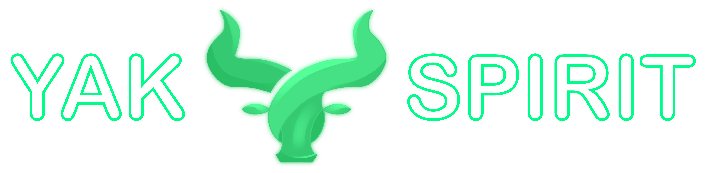

# 🐃 Yak Spirit Frontend


[](https://www.gnu.org/licenses/gpl-3.0)

> Interface for Yield Yak Swap

- Multiple **themes** and **languages** support.
- UI **customization**.
- Automatic quotes **fetching** — always up-to-date quotes — fastest updates and trading experience.
- Enables arbitrage trades (to/from the same asset)
- Comparing prices against 1inch and ParaSwap (thanks for the idea @adrotitanique)
- Example of [Yak Swap UI component](https://github.com/dragoonzx/yak-swap-ui) usage — earn fees with reusable React component
- With community in mind — feel free to contribute!

<p align="center">
  
</p>

# Set up

```shell
mv .env.example .env.local
yarn
yarn dev
```

# Contributing

Interested in contributing to the Yak Spirit or Yak Swap UI? Thanks so much for your interest! We are always looking for improvements to the project and contributions from open-source developers are greatly appreciated.

If you have a contribution in mind, please open issue or PR with your ideas.

# Licence

Yak Spirit & Yak Swap UI is [GNU-3 licensed](https://github.com/dragoonzx/yak-spirit/blob/main/LICENSE)

<p align="center">
  
</p>
